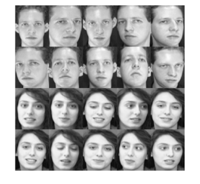

# Robust Sparse Smooth Principal Component Analysis (RSSPCA)

[](https://opensource.org/licenses/BSD-3-Clause)

RSSPCA is a novel dimensionality reduction method combining robustness, sparsity and smoothness properties for face reconstruction and recognition tasks. The algorithm solves the following optimization problem:

$$\mathop{\max}_{w}\lVert X^Tw\rVert_1,  s.t. \lVert w\rVert_2^2=1,  \lVert w\rVert_1<=c_1, w^TLw<=c_2$$

where $c_1$ and $c_2$ are positive constants, and $L$ is a Laplacian matrix representing the two-dimensional spatial structure information of images.

The algorithm combines robustness (for outliers/noise resistance), sparsity (for feature selection), and smoothness (for spatial relationship preservation). It has been validated on six benchmark face databases (AR, FEI, FERET, GT, ORL, Yale) against methods including PCA, PCA-L1, RSPCA, and RSMPCA.

To run the demo, execute `main.m` in MATLAB. For large-scale applications, a parallel computing version is available at [RSSPCA_parallel](https://github.com/yuzhounh/RSSPCA_parallel). Additional benchmark face databases can be found [here](https://github.com/yuzhounh/Face-databases).


### Face Samples

The ORL face database contains 400 face images from 40 subjects, with 10 images per subject. The images were captured with different facial expressions, rotations, and slight scale variations. The original image size is 112 by 92. To reduce computational time, we further resized the images to 56 by 46. The images of two subjects in this database are shown in Fig 1.

<figure align="center">
  
  <figcaption>Fig 1. Sample images of two subjects in the ORL database.</figcaption>
</figure>
<br><br>

Among the 400 images in the ORL face database, 80 images were randomly selected and occluded with a rectangular salt-and-pepper noise whose size was not smaller than 10 by 10, located in a random position, as shown in Fig 2.

<figure align="center">
  
  <figcaption>Fig 2. Samples of noisy images. The first row shows the clear images. The second row shows the noisy images.</figcaption>
</figure>
<br><br>

### Reconstruction Results

When the optimal parameters are selected, the reconstructed images of the five algorithms on six sample images are shown in Figs 3 and 4. The first 30 projection vectors were used to compute these reconstructed images.

<figure align="center">
  
  <figcaption>Fig 3. Reconstructed images of clean images from the polluted ORL database. The first column shows the original images, and the last five columns show the reconstruction images of the clean images generated by PCA, PCA-L1, RSPCA, RSMPCA, and RSSPCA, respectively.</figcaption>
</figure>
<br><br>

<figure align="center">
  
  <figcaption>Fig 4. Reconstructed images of noisy images from the polluted ORL database. The first column shows the original images, the second column shows the noisy images, and the last five columns show the reconstructed images of the noisy images generated by PCA, PCA-L1, RSPCA, RSMPCA, and RSSPCA, respectively.</figcaption>
</figure>
<br><br>

### Generalized Eigenfaces

Next, we visualized the projection vectors to intuitively illustrate the effects of robustness, sparsity, and smoothness. The projection vectors were computed by the five algorithms, i.e., PCA, PCA-L1, RSPCA, RSMPCA, and RSSPCA, using the entire ORL face database. For each algorithm, the parameters were set to the optimal ones listed in Table 2. After obtaining the projection vectors, each of them was reshaped into a 56×46 image for plotting. The visualization representation of the projection vectors generated by PCA is referred to as eigenfaces [44]. Therefore, the visualization representations of the projection vectors generated by the variants of PCA are called generalized eigenfaces in this paper.

The first five generalized eigenfaces by the five algorithms are shown in Fig 5. The lighter-colored points in the figure correspond to higher values of elements in the projection vectors, indicating that these points have higher weights in the low-dimensional space.

<figure align="center">
  
  <figcaption>Fig 5. Visualization representation of the first five projection vectors, i.e., generalized eigenfaces, obtained by the five algorithms. The five rows correspond successively to the first five projection vectors. The five columns correspond to the projection vectors obtained by PCA, PCA-L1, RSPCA, RSMPCA, and RSSPCA, respectively.</figcaption>
</figure>
<br><br>

The projection vectors of PCA and PCA-L1 are similar, indicating that robustness has limited effects on the projection vectors. From the results of face reconstruction and recognition, we observe that the influence of robustness becomes more prominent when the face database is heavily contaminated with noise. Given that the eigenfaces are trained on clean images, it is unsurprising that the impact of robustness is minimal.

The eigenfaces generated by RSPCA, RSMPCA, and RSSPCA are quite different from those generated by PCA and PCA-L1. Specifically:

- The projection vectors derived by RSPCA are highly sparse. Only few features are extracted in each projection vector:
  - The first projection vector emphasizes on the crown of the head
  - The second projection vector emphasizes on the eyes, noses, and mouth
  - The third projection vector emphasizes on cheeks and jaws
  - The fourth and fifth projection vectors emphasize on the facial contours

- The projection vectors derived by RSMPCA are smooth. RSMPCA can be generated by incorporating smoothness into PCA-L1. The eigenfaces of RSMPCA appear to be a smoothed version of those obtained by PCA-L1. Therefore, smoothness plays a crucial role in the feature extraction process of RSMPCA.

- The projection vectors derived by RSSPCA are both sparse and smooth. The eigenfaces of RSSPCA appear to be a combination of those obtained by RSPCA and RSMPCA. Therefore, both sparsity and smoothness take effects on the eigenfaces of RSSPCA.

### Supplementary Materials

The supplementary materials containing face examples from each dataset can be found in [Supplementary Materials.pdf](Supplementary_Materials.pdf).

### Citation

If you use this code, please cite our paper:
```
@article{wang2025robust,
author = {Jing Wang and Xiao Xie and Li Zhang and Jian Li and Hao Cai and Yan Feng},
title = {Robust sparse smooth principal component analysis for face reconstruction and recognition},
journal = {PLOS ONE},
year = {2025},
volume = {20},
number = {5},
pages = {e0323281},
doi = {10.1371/journal.pone.0323281}
}
```

### Contact 
Jing Wang (wangjing@xynu.edu.cn)
